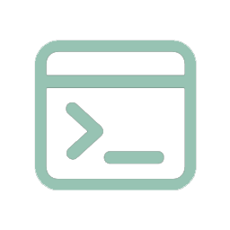

  
  
<center></center>

<h3 align="center">DeepForge Toolset - cross-platform installer of necessary tools for programming.

</h3>

---
## Requirements
- ##### Python 3.7 or hight
- ##### OS: Windows 10 or hight, macOS 11 (BigSur) or hight, Linux
- ##### Supported installers: WinGet (Windows), HomeBrew (macOS), Snap (Linux)

---
## Supported Linux distributions
- ##### Based on Debian (Kali Linux, Pop OS,Ubuntu, Linux Mint, elementary OS, Lubuntu, Knoppix, Zorin OS and other)
- ##### Based on Red Hat (CentOS, CentOS Stream, Red Hat Enterprise Linux, Fedora, Alma Linux,Oracle Linux and other)
- ##### Based on Arch Linux (Manjaro and other)
---
## 🚀 Installation

### 🪟Windows
##### ⬇[Download for amd64](https://github.com/DeepForge-Tech/DeepForge-Toolset/releases/tag/v0.1_win_amd64)

### 🐧Linux
##### ⬇[Download for amd64](https://github.com/DeepForge-Tech/DeepForge-Toolset/releases/tag/v0.1_linux_amd64)

##### ⬇[Download for arm64](https://github.com/DeepForge-Technology/DeepForge-Toolset/releases/tag/v0.1_linux_arm64)
### 🍏 macOS

##### ⬇[Download for amd64](https://github.com/DeepForge-Tech/DeepForge-Toolset/releases/tag/v0.1_macOS_amd64)

---

## ⚙️ Build from source

### 🪟Windows

```powershell
git clone --recursive https://github.com/DeepForge-Tech/DeepForge-Toolset.git
cd DeepForge-Toolset
python .\ConfigureTools\InstallPackages.py
mkdir build
cd build
cmake .. -DCMAKE_BUILD_TYPE="Release"
cmake --build .
# Run DeepForge-Toolset
cd bin && .\DeepForge-Toolset
```


### 🐧Linux

```bash
git clone --recursive https://github.com/DeepForge-Tech/DeepForge-Toolset.git
cd DeepForge-Toolset
python3 ./ConfigureTools/InstallPackages.py
mkdir build
cd build
cmake .. -DCMAKE_BUILD_TYPE="Release"
cmake --build .
# Run DeepForge-Toolset
cd bin && sudo .\DeepForge-Toolset
```

### 🍏 macOS

```bash
git clone --recursive https://github.com/DeepForge-Tech/DeepForge-Toolset.git
cd DeepForge-Toolset
# If you have installed python 3
python3 ./ConfigureTools/InstallPackages.py
# else
sudo bash ./ConfigureTools/InstallPackages.sh
mkdir build
cd build
cmake .. -DCMAKE_BUILD_TYPE="Release"
cmake --build .
# Run DeepForge-Toolset
cd bin && .\DeepForge-Toolset
```

---
## ✅ Tests

```bash
cd build
ctest
```
## 👥 Authors

1. [Blackflame576](https://github.com/blackflame576)
2. [DeepForge-Technology](https://github.com/DeepForge-Tech)
3. 
## 🤖 Support

##### 📧[Email](mailto:deepforge.technology@gmail.com)
##### 💬[Telegram](https://t.me/deepforge_toolset)
## 💳 Donating

##### 💰[Boosty](https://boosty.to/deepforge/donate)

##  ℹ️ License
[GNU GENERAL PUBLIC LICENSE](LICENSE)