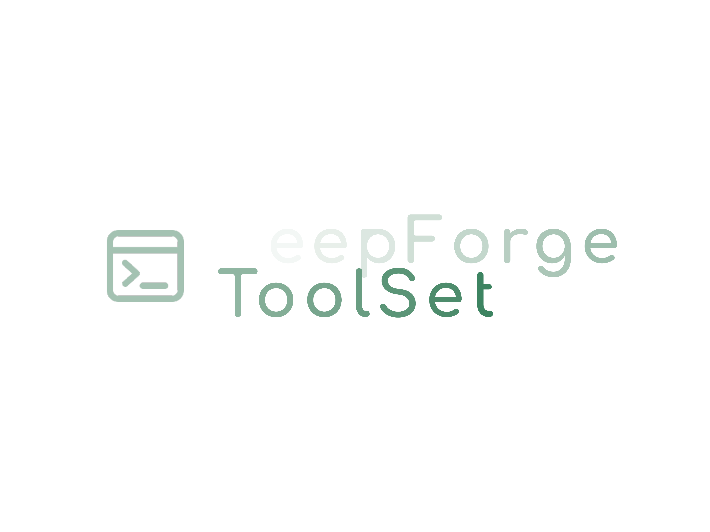

<h2 align="center">DeepForge Toolset</h2>
<h3 align="center">DeepForge Toolset - installer of necessary tools for programming.</h3>

## 🚀 Installation(Установка)

Windows

<a href="https://github.com/DigitalBitTechnologies/DeveloperTools/releases/tag/InstallerDeveloperTools_win_amd64">Download for amd64(Загрузить для amd64)</a>

Linux

<a href="https://github.com/DigitalBitTechnologies/DeveloperTools/releases/tag/InstallerDeveloperTools_linux_amd64">Download for amd64(Загрузить для amd64)</a>

MacOS

<a href="https://github.com/DigitalBitTechnologies/DeveloperTools/releases/tag/InstallerDeveloperTools_macos_amd64">Download for amd64(Загрузить для amd64)</a>

## Authors(Авторы)
 - @Blackflame576
 - @DeepForge-Technology
## Support(Поддержка)
 - deepforge.technology@gmail.com
## Donating(Донаты)
## License(Лицензия)

